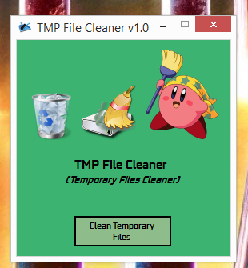
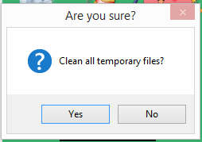
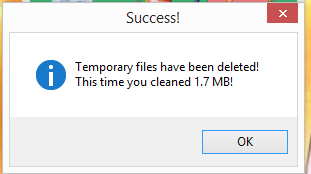

# Temporary Files Cleaner
For Windows OS only!

- A simple small program for Windows Operating Systems that cleans all the junk/temporary files/temporary folders from Windows OS! In time, if not cleaned by a specific time basis, this folder tend to really increase its size resulting in a massive **HDD / SSD** space usage just by keeping unwanted junk files!

- The Temp folder location is in --> **C:\Users\username\AppData\Local\Temp** that can be accessed by advanced users typing "**%temp%**" or "**%appdata%**" into Windows Search Bar.

## What does this program do really?
- Clears all the junk/temporary files/temporary folders
- Shows how much space you freed.
- Easy to use

## Pictures of the UI

